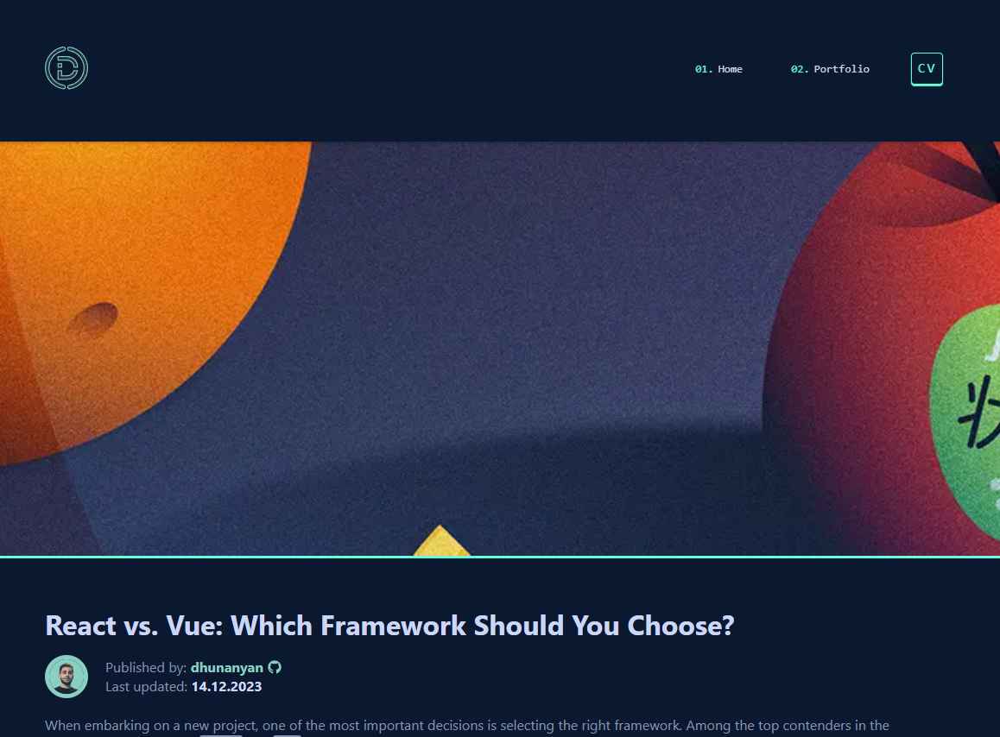
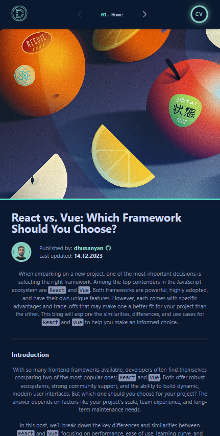

<h1 align="center">
  <a href="https://blog.dhunanyan.com" alt="Official Website">
    <p>blog.dhunanyan.com</p>
    
  </a>
</h1>

## 🌐 Davit Hunanyan - Blog [](https://app.netlify.com/sites/dhunanyan-blog/deploys)

Hello and welcome to **Code Chronicles**! 🎉

This blog is dedicated to **React.js**, **JavaScript**, and modern **frontend development**. Whether you're a beginner or an experienced developer, you'll find **insightful tutorials, best practices, and deep dives** into the React ecosystem.

## 📸 Screenshots

| Desktop                                              | Mobile                                             |
| ---------------------------------------------------- | -------------------------------------------------- |
|  |  |

## 🎨 Overview

**Code Chronicles** is a blog dedicated to **React.js** and modern frontend development. Created by a Software Engineer, this blog explores the latest trends, best practices, and hands-on tutorials to help developers build efficient and scalable applications.

Whether you're just starting out or looking to level up your React skills, **Code Chronicles** provides **insightful articles, coding techniques, and deep dives** into the React ecosystem.

From **React Hooks** to **performance optimization**, you'll find content that simplifies complex topics and enhances your development workflow.

Join the journey and let's write better code together! 🚀

## ✨ Features

- **Fast & Responsive**: Built with modern web standards for a smooth and responsive experience across devices.
- **SEO Optimized**: Utilizing Next.js SEO features to ensure the dhunanyan-blog stands out on search engines.
- **Dynamic Routing**: Each project and experience section dynamically routes to a detailed page.
- **API-Driven Content**: Project details, blogs, and experience info fetched using server-side rendered data fetching from [**Contentful**](https://www.contentful.com 'Contentful').
- **Styled Components**: Elegant UI, with styled-components providing a maintainable and component-based CSS structure.

## 🖥️ Tech Stack

- **Framework**: [Next.js](https://nextjs.org 'Next.js') (React)
- **Styling** / **Animations**: [SASS](https://sass-lang.com 'SASS')
- **Content**: [Contentful](https://www.contentful.com 'Contentful')
- **TypeScript** ✔️
- **ESLint** ✔️
- **Prettier** ✔️
- **Husky** ✔️
- **App Router** ✔️
- **Deployment**: [Netlify](https://www.netlify.com, 'Netlify')

## 🎨 Colors

| Color                 | Hex                                                                  |
| --------------------- | -------------------------------------------------------------------- |
| $primary-color        |  `#0a192f`   |
| $secondary-color      |  `#ccd6f6`   |
| $tertiary-color       |  `#1e293b80` |
| $alt-color            |  `#8892b0`   |
| $alt-secondary-color  |  `#495670`   |
| $tint-color           |  `#64ffda`   |
| $tint-secondary-color |  `#89d0c2`   |
| $tint-tertiary-color  |  `#2dd4bf1a` |
| $tint-color-opacity   |  `#64ffdb46` |

## 🚧 Roadmap

Planned enhancements for future versions include:

- **Dark Mode**: Toggle for users to switch between light and dark themes.
- **CMS Integration**: Headless CMS integration to easily manage dhunanyan-blog content.
- **Blog**: A blog for sharing insights and tutorials.

## ⚙️ Installation & Set Up

1. **Clone the repository**

```bash
git clone https://github.com/davithunanyan/dhunanyan-blog.git
```

2. **Navigate to the project directory**

```bash
cd dhunanyan-blog
```

3. **Set Node version to 20 using NVM**

```bash
# WARNING - this can be done manually by downloading the version from https://nodejs.org/en/download/package-manager
nvm use `cat .nvmrc` # Windows
nvm use # MacOS / Linux
```

3. **Install dependencies**

```bash
yarn install
```

4. **Start the development server**

```bash
yarn dev
```

This command starts the app in development mode. Open [http://localhost:3000](http://localhost:3000) to view it in the browser.

## 🛠 Building and Running for Production

1. **Generate Static Build**

```bash
yarn build
```

This command optimizes the app for production, including compiling and minifying files.

2. **Run the Production Build**

```bash
yarn start
```

Your Next.js app will start on http://localhost:3000 and be ready for high-performance production use.

## 🚀 Deployment

1. **Deploy to Netlify**

Create PR to **`netlify`** branch and merge it or in order to force:

```bash
  git branch -m netlify
  git push -f origin netlify
```

There are not Git workflows are other automation created for extra testing layer before production build (such as unit tests, jest coverage etc...). So each time anything is being merged to **`netlify`** it triggers a deployment job on [**Netlify**](https://app.netlify.com/sites/dhunanyan/deploys) side.
